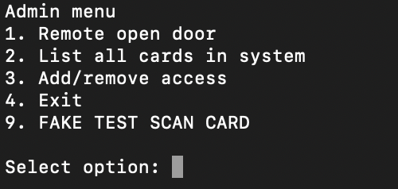
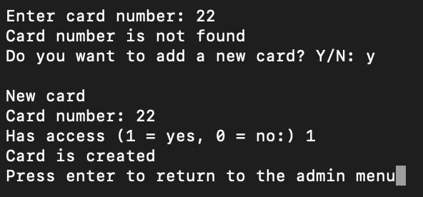
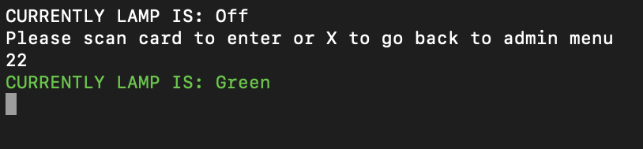

# Card Access Control

A **C program** for managing access cards and door control.

The system allows you to:
- Add and modify cards  
- Test cards in a "card reader simulation mode"  
- List all registered cards  
- Remotely open the door  

All cards are stored in a binary file named **`cardlist.bin`**.  
When the program starts, this file is automatically loaded.

---

## Main Menu



---

## Example Add New Card



---

## Example Card Scan Test



---

## Technical Details

- Written in **C**
- Uses **binary files** (`fread` / `fwrite`) to store card data  
- **Dynamic memory allocation** using `malloc()` and `realloc()`  
- **Safe user input** handled through `safeinput.h`  
- **Colored terminal output** using ANSI escape codes for red/green text

## How to Build and Run

### 1. Clone the repository
```
git clone https://github.com/szandraugustsson/Card-system.git
cd Card-system
```
Linux/macOS:

### 2. Build the program
```
make
```
### 3. Run the program
```
./main
```
### 4. Clean build files (optional)
```
make clean
```
### Note: Make sure you have Xcode Command Line Tools installed on macOS to use make
```
xcode-select --install
